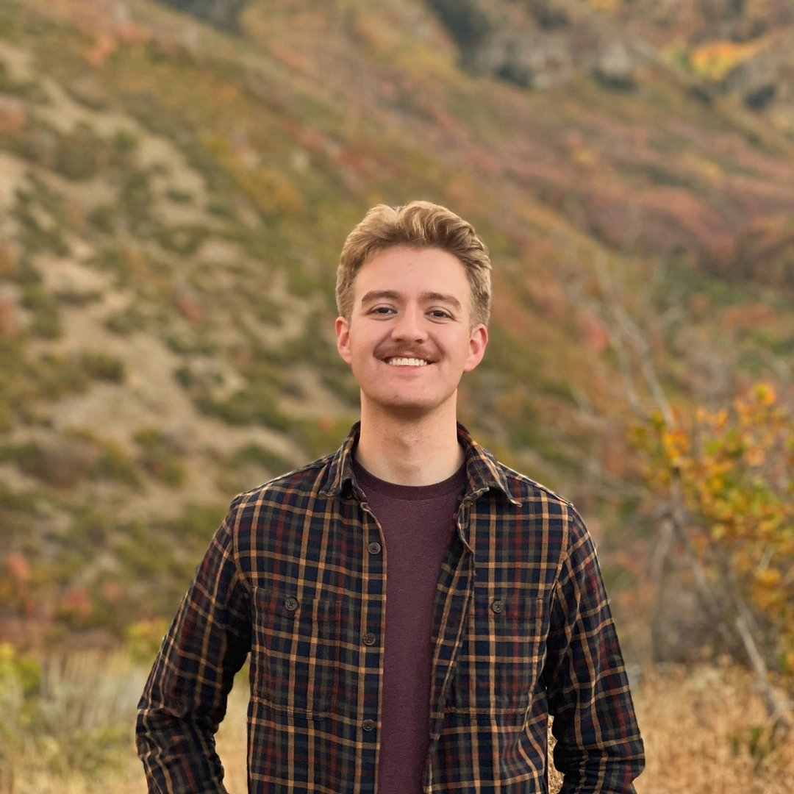

::: {.hero-banner .text-center}

<h1>Adam Cottrell</h1>

<a href="https://linkedin.com/in/adam-cottrell" class="btn btn-outline-primary btn-sm" target="_blank">
  <i class="fab fa-linkedin"></i> LinkedIn
</a>
<a href="https://github.com/adam-cott" class="btn btn-outline-primary btn-sm" target="_blank">
  <i class="fab fa-github"></i> GitHub
</a>

:::

I am a junior at BYU's Marriott School of Business, studying Strategic Management. I'm interested in how organizations actually work once the slide decks are gone—how decisions get made, how teams stay aligned, and why some good ideas never make it past execution.

I like strategy, but only when it connects to real people and real outcomes. That's probably why I enjoy the mix of economics, operations, and leadership that my program offers. I currently work as a Teaching Assistant for STRAT 392: Strategy and Economics, which has pushed me to slow down and really understand ideas well enough to explain them simply.

One of the most formative experiences in my life was spending two years in Los Angeles as a volunteer church missionary. The work was demanding and required constant learning and adaptation. I had to learn Spanish from the ground up, and now I speak it fluently, which taught me how to think clearly under pressure and communicate when precision really matters. Over time, I served in leadership roles where I trained new missionaries, led groups of twenty or more, set goals, tracked performance, and coached people through challenges that were often unfamiliar and complex.

Recently, I have become increasingly interested in technology and development as tools for leverage. I am building skills in SQL, R, and data analysis, and experimenting with small app projects using AI to solve practical problems. I am not drawn to technology just because it is impressive. I am drawn to it when it removes friction, reveals insight, or helps people make better decisions without making their work more complicated.

What drives me is progress you can actually see. I enjoy turning messy problems into clearer ones, connecting strategy to execution, and learning by building and doing. I do not expect to have everything figured out, but I care a lot about improving steadily and doing work that genuinely helps.

Outside of school and work, I spend a lot of time hiking, playing guitar, singing, and working on my goal to one day visit every U.S. national park. I try to keep a full life alongside my work, because the best thinking usually happens when you step away for a bit.
